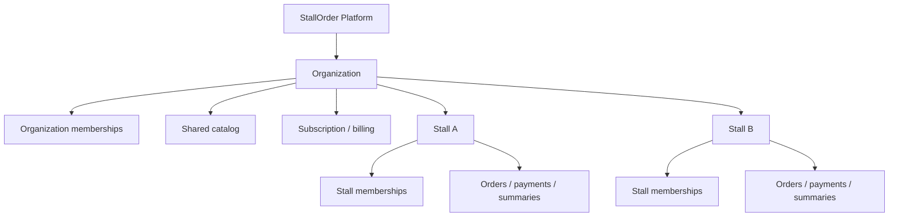

# 多攤位架構

## 目標與原則

StallOrder 採單一 SaaS 應用、單一 Supabase 專案與單一 PostgreSQL 資料庫。攤位不是 tenant；`Organization` 才是商務與計費邊界，`Stall` 是組織下的營運位置。



核心規則：

- 每筆組織資料帶 `organization_id`。
- 每筆攤位營運資料同時帶 `organization_id` 與 `stall_id`。
- 用戶身分與授權分離；Google/Supabase Auth 只證明身分，membership 才授權。
- client 提供的 `organizationId`、`stallId`、role 與 localStorage 選擇都不是授權證據。
- Next.js API 與 Edge Functions 必須在伺服器重新解析 session、membership 與物件範圍。
- RLS 是資料庫最後一道邊界，前端隱藏控制項不視為安全控制。

## 元件責任

| 元件 | 責任 |
| --- | --- |
| Next.js | 商戶/店員 UI、應用 session、CSRF、RBAC、可信 API、SSR 路由保護 |
| Supabase Auth | Google OAuth PKCE、驗證 Email、Auth user/session |
| PostgreSQL | tenant scope、約束、RLS、摘要、事件、稽核、usage 與交易一致性 |
| Edge Functions | 匿名 QR session、公開建單、公開訂單追蹤與 Turnstile |
| Supabase Realtime | 已授權 operational event/alert 通知，不作 source of truth |
| Prisma | Next.js 伺服器的參數化資料存取，不提供給瀏覽器 |

## 身分與授權

`profiles.auth_user_id` 唯一對應 `auth.users.id`。同一 profile 可同時擁有多個組織與攤位 membership：

- 組織角色：`ORGANIZATION_OWNER`、`ORGANIZATION_ADMIN`、`FINANCE_VIEWER`。
- 攤位角色：`STALL_MANAGER`、`STAFF`、`KITCHEN`。
- `ORGANIZATION_ADMIN.all_stalls=false` 時，只能配合攤位 membership 存取指定攤位。
- 組織 owner 可使用 `ALL_STALLS`；只有攤位角色的帳號只能看到指派攤位。
- `PLATFORM_ADMIN` 為平台維運角色，不能由商戶邀請流程授予。

應用登入完成後建立獨立八小時 opaque session。資料庫只保存 token hash；寫入請求再驗證同源 Origin、CSRF cookie/header 與 session 綁定 hash。

## 工作區解析

1. 伺服器由應用 session 取得 profile。
2. 讀取有效 organization/stall memberships。
3. 過濾停用攤位與不可營運的組織狀態。
4. 建立每個組織的授權攤位集合與有效角色集合。
5. 多組織導向 `/select-organization`；多攤但無全攤權限導向 `/select-stall`；單攤直接進入該攤位。

localStorage 只保存 UI 偏好，URL 參數仍會逐次與授權集合比對。

## 商品架構

- `product_categories`、`product_groups`、`products` 是組織主檔。
- `stall_products` 是攤位分派與覆寫層。
- 有 `price_override` 時使用覆寫價，否則使用 `products.default_price`。
- `is_enabled`、`is_sold_out`、`sort_order` 皆由攤位獨立設定。
- 商品停用採 soft delete；歷史 `order_items` 保存名稱與單價快照，不回算目前商品價格。

目前資料庫沒有既有 modifier 模型可安全遷移，因此 modifier group/item 共用化列為後續 migration，不在本階段臆造資料。

## 訂單與營運資料流

公開點餐：

```text
Static QR
→ create-order-session Edge Function
→ hashed, one-use, short-lived order session
→ Turnstile + create-public-order Edge Function
→ transactional RPC validates scope/product/limits/session
→ WAITING_CONFIRMATION
→ staff confirmation
→ kitchen preparation
→ pickup code verification
→ manual cash checkout
```

商戶操作：

```text
Application session
→ CSRF + rate limit
→ RBAC + authorized organization/stall set
→ Prisma transaction
→ audit log / operational event / summary / usage trigger
```

## 報表與即時更新

- `daily_stall_summaries` 以攤位時區及營業日聚合，不在開啟儀表板時掃描全部歷史訂單。
- Dashboard API 限制最長 93 天，只接收授權攤位集合。
- 訂單、付款、攤位狀態與售罄變更先提交 PostgreSQL，再產生 `operational_events`。
- Dashboard 使用 organization filter，店員/廚房使用 stall filter；重要事件後重新抓取權威資料。
- Dashboard 45 秒輪詢；員工看板另有 SSE、5 秒斷線 fallback 與 30 秒 safety refresh。

## 商務邊界

方案、subscription、額外攤位核准、invoice 與 usage 都以 organization 為主體。建立攤位前會鎖定 subscription，檢查狀態、included/max stalls、目前有效攤位與人工核准數量，避免競態超額建立。

## 不變量

- 不建立每攤一個 repository、前端、資料庫或 Supabase 專案。
- 不把 organization 固定欄位存回 profile。
- 不允許匿名直接寫入訂單。
- 不允許 Kitchen 讀取財務資料或 Finance 修改營運資料。
- 不依賴 channel 名稱、前端 role 或 client scope 做唯一授權。
