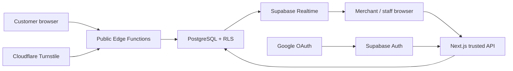

# StallOrder SaaS 架構

## 系統邊界

公開與已登入流量使用不同信任邊界：

- Customer browser 只呼叫三支公開 Edge Function，不直接寫 DB。
- Merchant/staff browser 經 Next.js application session、CSRF、RBAC 與 scope API。
- Supabase Auth 提供 Google identity；application profile/membership 決定權限。
- PostgreSQL constraint/RLS 保護所有資料路徑，包括 Realtime。

## Multi-tenancy

`organizations.id` 是 tenant key。`stalls.organization_id` 建立一對多。每個 operational child 明示 organization + stall，便於 RLS、索引、未來 partition 與報表，並由 trigger 驗證 parent scope。

Profile 不保存固定 tenant。Membership 可讓一人屬於多個組織/攤位，且同人可同時具有財務與特定攤位操作角色。最後一名 owner 不能移除。

## 存取模式

- Public read/write：Edge service role + 固定 RPC；RPC 重驗 QR/session/product/limits。
- Authenticated read：Supabase RLS/select grant，供 Realtime 等功能。
- Authenticated mutation：Next.js trusted server + Prisma transaction；client 不持有 DB credentials。
- Platform operation：明確 `PLATFORM_ADMIN`，不可由 organization invitation 授予。

## 資料一致性

- Conditional update/transaction 保護 order state 與一次性 session。
- Scope trigger 驗 organization/stall/parent。
- 訂單 item 保存商品名稱/價格快照。
- Order/payment trigger 重建單日 summary。
- DB transaction 提交後產生 operational event。
- Usage reference ID 與 idempotency key 去重。

## 安全控制

- CSP、HSTS（production）、frame deny、nosniff、strict referrer、permissions policy。
- Opaque application session、HttpOnly/Secure/SameSite、double-submit + session-bound CSRF。
- 登入與 authenticated API rate limit。
- QR state、hashed short session、Turnstile server verification、六維 rate limit。
- Strict Zod/JSON size、Prisma parameterization、fixed SQL RPC。
- Audit before/after、public attempt log、request ID 與集中式 stdout。

## 可用性與效能

- Realtime 失效時 Dashboard 45 秒輪詢；staff 使用 SSE、5 秒 fallback、30 秒 safety refresh。
- Daily summary 避免每次掃描歷史 orders。
- Date range、stall list、public product 與 JSON body 都有限制。
- Health endpoint 僅回傳 DB 可用性，不暴露連線資訊。
- 備份/PITR、migration staging、secret/QR rotation 與 fail-closed Turnstile 納入維運。

## 擴充規則

新增 organization-owned table 必須有 scope、FK/index、RLS/grant、scope trigger、audit/usage（如適用）與跨 tenant pgTAP。只有量測證明需要時，才加入 organization summary、partition、queue 或 cache。

## 商業帳務邊界

Plan Version 與 Entitlement Engine 決定功能與限制；Provider 只能收款與回報。Invoice、付款驗證、Subscription、Usage Event 與 audit 由可信 server transaction 管理。Future Provider／Tax tables 採複合 tenant FK、FORCE RLS 與 service-only grants，詳見 [COMMERCIAL_BILLING_ARCHITECTURE.md](COMMERCIAL_BILLING_ARCHITECTURE.md) 與 [BILLING_RLS.md](BILLING_RLS.md)。

## 商家申請邊界

申請資料在核准前不屬於任何 Organization，並由 applicant profile RLS 隔離。Platform Admin 核准才以單一交易建立 Organization、Owner、Trial、CLOSED Stall 與 PAUSED QR。測試訂單完成不會自動開店；只有 Organization Owner 的明確 Go-live transaction 可開放 QR。詳見 [MERCHANT_APPLICATION_ARCHITECTURE.md](MERCHANT_APPLICATION_ARCHITECTURE.md)。
