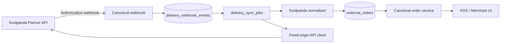

# StallOrder × foodpanda

狀態：程式骨架與已選 API contract 已實作；全部 foodpanda flags 預設關閉；Sandbox 與 Production 均未啟用。

## 架構

## 設定

1. 在 secret manager 建立 client secret 與 webhook Authorization 值。
2. 只將 `vercel://...` 或其他允許的 reference 寫入設定；不可把 raw secret 寫入 DB。
3. 設定 `.env.example` 所列 `FOODPANDA_*` 變數。
4. 套用 expand-only migration 後，確認所有新 flags 仍為 `false`。

## 測試與部署

- Local：執行 `npm test`、`npm run typecheck`、`npm run lint`、`npm run build`。
- Sandbox：依 [E2E test plan](FOODPANDA_E2E_TEST_PLAN.md) 使用 foodpanda 測試帳號。
- Deployment：只允許 disabled deployment；啟用順序與 Gate 見 [production checklist](FOODPANDA_PRODUCTION_CHECKLIST.md)。
- 故障處理：見 [runbook](FOODPANDA_RUNBOOK.md) 與 [rollback](FOODPANDA_ROLLBACK_PLAN.md)。

## Feature Flags

先決條件：`DELIVERY_PLATFORM_FOUNDATION_ENABLED`、provider entitlement 與 approved connection。Provider flags：

- `FOODPANDA_INTEGRATION_ENABLED`
- `FOODPANDA_PARTNER_API_ENABLED`
- `FOODPANDA_WEBHOOK_ENABLED`
- `FOODPANDA_ORDERS_ENABLED`
- `FOODPANDA_CATALOG_READ_ENABLED`
- `FOODPANDA_CATALOG_WRITE_ENABLED`
- `FOODPANDA_OUTLET_ENABLED`
- `FOODPANDA_PRODUCT_CREATE_BETA_ENABLED`

最後一項未取得 foodpanda 明確核准前永遠保持 OFF。

## Security

Webhook 驗證、tenant mapping、replay 防護、secret 與 SSRF 邊界見 [security model](FOODPANDA_SECURITY_MODEL.md)。
