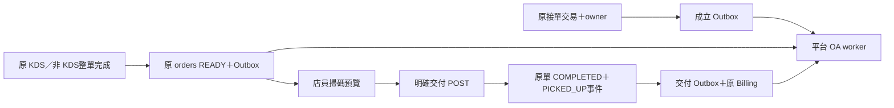

# LINE v2 架構決策

2026-09-27，本機候選。一個平台會員、一個平台 OA、各店自己的 LINE Pay 商家直收；不另建 Order、密碼系統、平台代收或計費核心。

## 身分與 sender

官方驗 raw ID Token 的 issuer/expiry/精確 audience 後，以 `miniapp:{environment}:{providerId}:{sha256(environment,provider,sub)}` 對應原 AuthIdentity。相同 Email/暱稱不合併；Profile 沿用，Member 只增加條款版本/時間/來源、選填交易通知同意與撤銷。

一訂單一 immutable owner，固定 env/Provider/subject、建立時 pickup_required。原 session/device 驗證後同交易綁定；已有 owner 冪等重試不因門市停止新單改收件人。舊 merchant OA 綁定不能自動搬移。顧客看本人跨店資料，商家只看本店。

2026-09-28 回店家點餐或復原購物車仍沿用原 `/order/[trackingToken]` 完成入口。伺服器以 Token 雜湊及目前會員完整 profile/environment/provider/subject 比對不可變 owner，精確命中才導向 `/mini/orders/[orderId]`；不依賴舊訪客裝置 cookie。非 owner、未登入或 optional LINE 設定失敗維持既有追蹤驗證，不能借此取得他人私有訂單。Next redirect 在 optional-error catch 外執行。回歸包含原入口實際導頁、PNG 顯示與其他會員 404。

每環境一個 PLATFORM_OA registry，由伺服器設定與 PLATFORM_ADMIN 同步。商家不能指定 sender/to/任意 Flex 或讀平台 Vault。Worker 先比對 bot/info destination，再使用固定 OA token；Pay/MINI token 不混用。

## 唯一狀態來源

付款、印單、預估時間、看圖 GET、preview 都不代表交付。建立時凍結 pickup_required 的 TAKEOUT 單受 DB guard 保護；舊 checkout 不能繞過。Push I/O 在 commit 後，失敗不回滾履約。

首次發送前固定收件人、JSON bytes、retry key、模板及首次時間。未知結果同 key/body 恢復，超 24 小時轉人工。UI「LINE 已接受」不冒稱送達/已讀。

## 付款及恢復

擴充原 payment_provider_transactions/refunds；attempt 為一對一延伸。原 payments 仍是入帳事實，online_order_payment_intents 保持 LOCAL_MOCK；SaaS 訂閱 PaymentAttempt 不挪用。

每 attempt 固定 Organization/Stall/商家/Channel/API v4/credential version。Request/Confirm/Refund 先 durable operation 再外部 I/O，90 秒 lease/fence。UNKNOWN 不盲重送、不釋放退款保留、不允許假裝安全重付。Worker 只查 Check/Details；無證據不標已付/已退。付款與原 outbox 同交易，完成計費及全退沖銷沿原 trigger，adapter 不另收 NT$1。

此候選只有固定 Sandbox host，沒有 Pay LIVE 開關；正式收款仍需另完成資格與適配驗收。

## 遷移與相容

20260927010000～070000 依序增加會員/owner、通知、票據、付款操作、恢復欄位、訪客購物車一次性歸屬及原接單交易衝突分類。原生 SQL 表/trigger 沿 SQL migration 管理，Prisma raw SQL 參數化；不可以 db push 取代 migration 或刪未列為 Prisma model 的原生表。新表 FORCE RLS；anon/authenticated 不得直讀私有身份/票據/快照。

通知原表 organization/stall 可空僅限 PLATFORM_OA，舊 sender 仍受 constraint/trigger 範圍限制。舊單不批次搬家、不重播未知通知。Pilot 以 environment/enabled/cutover 管控。回復保留 owner、帳本、快照、schema、憑證版本；不 destructive down。

## 授權矩陣

| 操作 | 顧客 | 店員/商家 | 平台 |
|---|---|---|---|
| 跨店訂單 | 僅 owner | 無顧客授權捷徑 | 不借用顧客 API |
| preview/交付 | 不可 | 本店 CHECKOUT_ORDERS＋CSRF | 仍不得繞店別 |
| 通知摘要/補發 | 不可 | 原管理權限、本店、有效用途/冷卻 | 全局維運固定 sender |
| Pay查核/退款 | 本人狀態 | 本店 MANAGE_PAYMENT_INTEGRATIONS＋CSRF | worker 僅恢復既有交易 |
| registry/配額/rollout | 不可 | 不可讀平台密鑰 | PLATFORM_ADMIN＋audit |

## 隔離與停用

MINI 訂單的新付款入口同時要求 runtime 開啟、訂單未結束且未付款，以及訂單精確 organization/stall 的 ACTIVE SANDBOX LINE_PAY connection：PUBLIC_MENU 渠道、secret/merchant reference、API v4與credentialVersion。不能因平台開啟付款就對所有店顯示入口。已有 attempt 的狀態與恢復入口不因店別設定停用而隱藏；後端仍於每次 checkout 獨立驗證，頁面判斷不是收款授權。

### 既有好友的官方查核

會員於 Webhook 啟用前已加好友時，不會補送 follow 事件。會員中心在 UNKNOWN 時自動查核，並提供「重新確認好友狀態」。瀏覽器只將 LIFF access token 送至同源、Session＋CSRF 保護的 POST `/api/mini/member/friendship`，不保存 Token。

伺服器依序向 LINE 驗證 access token 的 Channel、期限、profile scope，取得其 userId 並與已登入會員的環境／Provider／subject hash 比對，最後讀取官方 friendship API。只寫入目前平台 OA integration 的 `VERIFIED_API` 證據；外部查核後再次檢查會員未撤銷，較新簽章封鎖事件不被較舊查核覆蓋。API 故障顯示可重試錯誤，不能直接把 UNKNOWN 當作好友或合成 follow。既有 profile scope 足夠，不新增 LINE scope。

回歸：`friendship.test.ts`、`api/mini/member/friendship/route.test.ts`、`notification.integration.test.ts`；真實來源證據及公開 Preview QA 見 `PREVIEW_EXECUTION_20260928.md`。不改 schema 或通知同意。

新增旗標預設 false。部署環境、Channel、HTTPS Endpoint、DB fingerprint 各自驗證；fingerprint 是獨立設定比對，不能取代 provider readback/發布審查。Preview 不接受 Published audience、正式 host/DB。先停新單/新付款，保留在途查核與受控交付；整體 PLATFORM_ENABLED 關閉會停相關 API，不得有 pickup_required 單卻未安排交付就直接全關。
