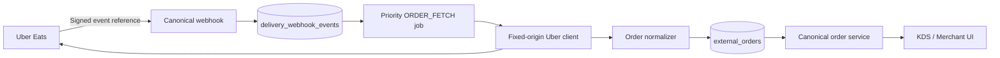

# StallOrder × Uber Eats Marketplace

狀態：application token、webhook、order fetch/accept/deny 與 sparse availability 已實作；merchant authorization completion、store activation、full menu 與其他進階 API 尚未實作。全部 Uber flags 預設關閉。

## 架構

## 設定

1. 建立 Uber Testing Developer App 與測試 store。
2. secret manager 保存 client secret 與 webhook signing secret；DB 只存 allowlisted reference。
3. 設定 `.env.example` 的 `UBER_EATS_*`，callback 必須與 Developer Dashboard 完全一致。
4. 套用 migration 後確認所有新 flags 仍為 `false`。

## 測試與部署

- Local：`npm test`、`npm run typecheck`、`npm run lint`、`npm run build`。
- Sandbox：依 [E2E plan](UBEREATS_E2E_TEST_PLAN.md) 驗證 webhook → ORDER_FETCH → import → accept/deny。
- 只可先做 disabled deployment；production 依 [checklist](UBEREATS_PRODUCTION_CHECKLIST.md) 與 [rollback](UBEREATS_ROLLBACK_PLAN.md)。

## Feature Flags

基礎 flags：`DELIVERY_PLATFORM_FOUNDATION_ENABLED`、`DELIVERY_EXTERNAL_ORDER_IMPORT_ENABLED`、`DELIVERY_PROVIDER_ACTIONS_ENABLED`。Uber flags：

- `UBER_EATS_INTEGRATION_ENABLED`, `UBER_EATS_OAUTH_ENABLED`, `UBER_EATS_API_ENABLED`
- `UBER_EATS_ORDERS_ENABLED`
- `UBER_EATS_MENU_READ_ENABLED`, `UBER_EATS_MENU_FULL_WRITE_ENABLED`, `UBER_EATS_MENU_ITEM_WRITE_ENABLED`
- `UBER_EATS_STORE_READ_ENABLED`, `UBER_EATS_STORE_STATUS_WRITE_ENABLED`, `UBER_EATS_STORE_ACTIVATION_ENABLED`
- `UBER_EATS_HOLIDAY_HOURS_WRITE_ENABLED`, `UBER_EATS_REPORTS_READ_ENABLED`
- `UBER_EATS_ORDER_READY_ENABLED`, `UBER_EATS_ORDER_READY_TIME_ENABLED`, `UBER_EATS_FULFILLMENT_ISSUES_ENABLED`

只有 Orders 與 Menu Item Write 有對應完整 adapter operation；其餘未完成 flags 必須維持 OFF。
