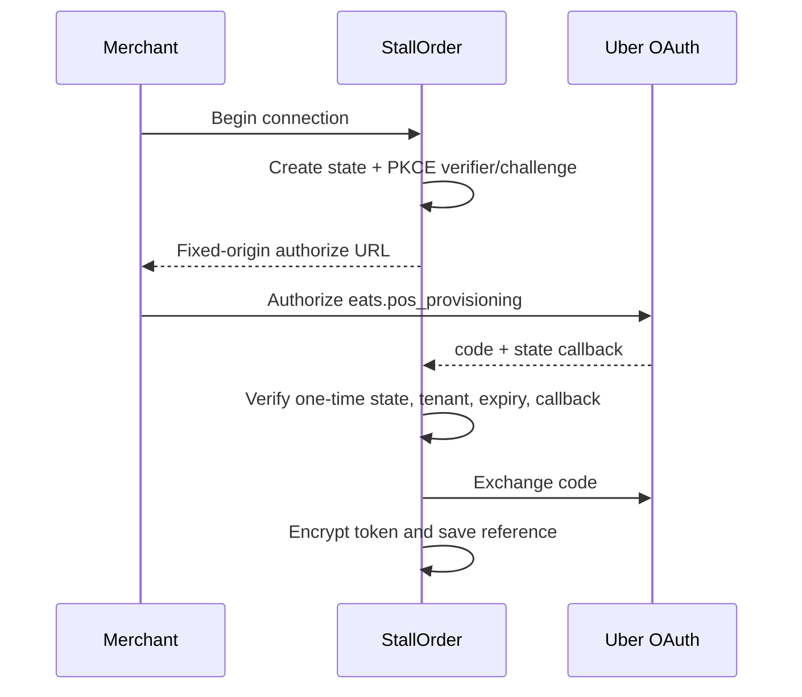

# Uber Eats OAuth Flow

目前只完成 authorize URL 組裝與 config validation。Callback state storage、single-use enforcement、code exchange、token encryption/reference、refresh/revoke 與 store activation 尚未實作。`UBER_EATS_OAUTH_ENABLED` 與 `UBER_EATS_STORE_ACTIVATION_ENABLED` 必須保持 OFF，直到以上流程與測試完成。
