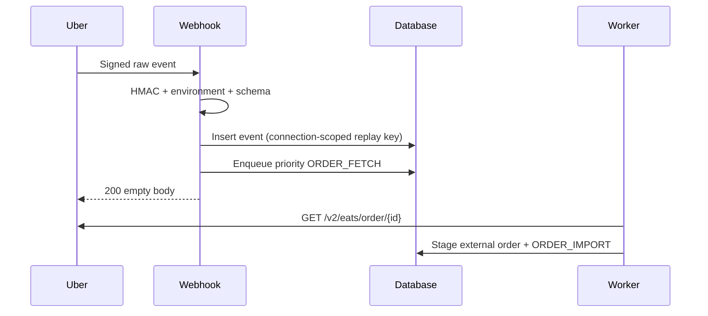

# Uber Eats Webhook Model

Uber event payload 只信任下列經 schema 驗證欄位：`event_id`、`event_type`、`meta.resource_id`（order）、`meta.user_id`（store）與 `resource_href`。

重複 event 回同一 durable 結果，不建立第二筆 canonical order。驗證失敗、unknown store、origin/path 不符、payload 過大均 fail closed。
