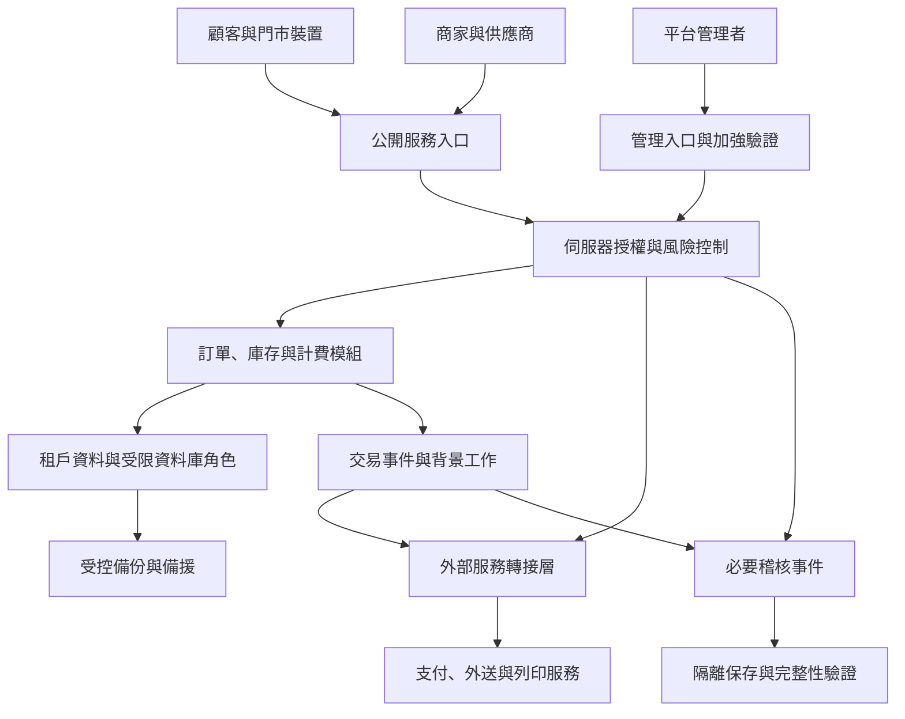

# 攤點通 Stallorder／Stellorder：安全架構與法遵補強分析

原評估日期：2026-09-13；架構更新：2026-09-29（Asia/Taipei）  
範圍：點餐、商家與平台管理、Supply Lite／OMO／供應鏈、平台 LINE 官方帳號與 MINI App、各店 LINE Pay、列印、配送、備援，以及後續 App。  
用途：工程改善與法律審查準備；本文件不代表已完成程式碼稽核、滲透測試、法律意見或任何認證。

## 1. 判斷與證據範圍

**建議沿用現有模組化單體，優先補齊資料、權限、交易與維運邊界，不必為此全面重寫或拆成微服務。** 跨商家資料外洩、管理權限濫用、支付重送及備援雙寫，應列為最高優先的查核項目。

本次比對原評估依據的 `Stallorder_OMO_Full_Architecture_Codex_Prompt.md`，以及 2026-09-09 的 OMO／SCM v2 架構、2026-09-24 的接力流程與 2026-09-27 的平台 LINE OA v2 規格。其中記載曾對 `KenLeeYa/Stallorder-Platform` 選定檔案做有限讀取，技術基線包含 Next.js／TypeScript、Supabase／PostgreSQL、Prisma，並以 Organization／Stall 區分租戶與門市。該文件不是本次對最新 repository 的直接讀取，不能推定全部目標已實作或發布。

| 依據 | 可以支持的判斷 | 本次不能據此宣稱 |
|---|---|---|
| 既有 OMO 架構文件 | 應延續既有帳本、組織／門市模型、Supply Lite、PAYG、QR 與列印契約 | 目前所有 route、RLS、背景工作都正確 |
| 歷史部署與 review 脈絡 | 曾使用 Vercel、Supabase Edge、DR；有應回查的安全議題 | 歷史缺失仍存在，或部署 Ready 就表示安全驗收通過 |
| 本次查核的官方法規與技術文件 | 可建立法規適用判斷及工程控制基準 | 已簽署有效委外契約、已取得支付資格或已通過認證 |

這些後續文件仍屬需求與歷史線索，並非最新 repository 或部署稽核。目前沒有最新 commit、正式環境設定、商家契約、資料存放區域、掃描報告及復原演練證據，因此不給虛構的合規百分比。後續執行的 Codex 應先固定版本與環境，再把每項要求分成「已驗證、部分完成、缺少、待確認、不適用」。

必須延續的業務契約：Google／LINE／Apple 登入方向、訪客點餐、既有 iPad／Star 列印、原 QR 路徑、單一交易與庫存帳本、每淨完成訂單 NT$1／每攤每月 NT$1,499 上限。此次安全補強不授權改價、開啟真實收費或新增平台保管顧客資金。

## 1.1 2026-09-29 架構增量與實作狀態

| 架構來源 | 目前目標契約 | 安全與法遵影響 | 現況證據 |
|---|---|---|---|
| OMO／SCM v2（09-09） | 保留點餐與 Supply Lite，擴充網店／POS、供應商、PO／SO、WMS／批次品質、TMS Lite、ePOD、配送離線、AP／AR | 每一企業、門市、供應商、承運者與買方的資料共享需明確授權；庫存、簽收、驗收、請款與付款各有權威事件 | 只取得規格；各 Phase 與 243 項驗收不能視為已通過 |
| LINE 平台 OA v2（09-27） | 平台單一 LINE Login／MINI App／Messaging OA，多店訂單及取餐通知在同一聊天室；各店各自 LINE Pay 收款 | 平台顧客身分、店家訂單所有權、通知收件者及商家收款憑證須分離 | 只取得規格；未核對 LINE 控制台、正式資格或現行程式 |
| Agent 接力（09-24） | 依 QR、OAuth、交易或 OMO 切片驗收，記錄來源版本及證據 | 安全審查不能以角色清單、測試名稱或歷史 review 代替本次運行證據 | 只取得工作流程；未執行本次 repository 測試 |
| 跨系統共餐／平台入口方向 | 商家可保留既有 POS／點餐系統，未來透過授權介接聚合需求與配送 | 僅作條件式威脅模型；需另核資料共享、委託、同意與第三方 API 契約 | 方向性需求，未認定已實作或已批准支付／配送模式 |

原文提及的 NT$1／每攤每月 NT$1,499 是 09-13 所依據的歷史計費契約；真正有效費率、上限與稅務政策須以現行 `PlanVersion`、契約及 repo 驗證，不在本文件調整或宣稱已啟用。

## 2. 建議的安全邊界

圖為建議的邏輯邊界，未宣稱每個方塊是獨立部署。Supabase Data API、Storage、Realtime、Edge 與雲端原始網域仍可能直接可達，必須分別有授權與限制；把自訂網域放進 WAF 不會自動保護所有入口。

| 邊界 | 放行條件 | 特別防止的問題 |
|---|---|---|
| 顧客 → 公開 API | 僅公開資料；下單／查單採對應授權、限流與伺服器校驗 | 以訂單號或 QR 當成全權憑證；匿名列舉姓名與電話 |
| 員工 → 所屬門市 | 有效會員關係、角色、操作範圍與必要功能授權 | 同組織員工越權查看其他分店；搜尋條件覆寫租戶限制 |
| 平台管理 → 商家資料 | 個人帳號、加強驗證、任務理由、限時授權、完整稽核 | 常駐超級管理員任意瀏覽全平台顧客 |
| 買方 → 供應商 | 有效交易關係與欄位最小化的共享投影 | 供應商看到買方全部顧客、其他供應商價格或全店營收 |
| 後端 → 資料庫 | 受限執行角色、明確租戶 context、交易範圍 | Prisma／service role 繞過 RLS；連線池殘留上一租戶 context |
| 背景工作 → 租戶操作 | 可信事件、重新授權、冪等、限次重試與單一 writer | 已撤權工作繼續匯出；同事件重複扣庫存或計費 |
| 雲端 → 門市裝置 | 每台裝置身分、固定門市與操作範圍、可撤銷 | 一把列印金鑰存取全平台；列印觸發付款或開錢櫃 |
| Primary → DR | 已核對身份、版本、複寫範圍與寫入 fence | split-brain、重複 webhook／排程、刪除的個資被還原 |

Supabase 的 service role 與 PostgreSQL 的特權角色可以繞過 RLS。僅看到資料表已啟用 RLS，不足以證明 Prisma 或 privileged RPC 的存取有被保護。[Supabase RLS](https://supabase.com/docs/guides/database/postgres/row-level-security)、[PostgreSQL row security](https://www.postgresql.org/docs/current/ddl-rowsecurity.html)。

## 3. 補強項目與優先順序

P0＝若確認缺失即優先處理並阻擋相關高風險功能擴大發布；P1＝正式營運必要；P2＝持續成熟化。這是優先順序，不表示每列都是已存在的漏洞。

| 優先 | 補強項目 | 具體作法與理由 | 驗收證據 |
|---|---|---|---|
| P0 | 多租戶與門市隔離 | 統一伺服器授權；RLS、DB role、同租戶外鍵、API、匯出與快取同時控制 | A／B 商家、同組織不同門市、撤權者的允許／拒絕測試 |
| P0 | 公開查單與 QR | 隨機受限憑證、用途／門市／期限綁定；短取餐碼限次；敏感欄位預設遮蔽 | 不能以訂單號、複製 QR 或猜測取餐碼讀取他人資料 |
| P0 | 平台管理權限 | 管理員 MFA／step-up、個人帳號、限時支援、重要權限與收款設定異動審核 | 不可自我升權；撤權即拒絕敏感操作；操作可追溯 |
| P0 | 金鑰與環境隔離 | 正式、測試、Preview、DR 分開憑證；測試同時校驗 DB、Storage、Edge、支付與通知目的地 | 任一正式 endpoint 混入測試即在副作用前停止 |
| P0 | 付款與退款完整性 | 驗簽、帳戶／訂單／金額／幣別比對、資料庫冪等與對帳 | 重送、亂序、逾時與退款競爭不重複執行 |
| P0 | DR 與單一 writer | 寫入 fence、切換版本、舊 writer 拒絕；備援通知、扣款與列印預設停止 | 分區／復原演練可證明無雙寫；不靠 DNS 判斷 writer |
| P0 | 列印與錢櫃 | 每台裝置獨立撤銷／輪替；工作領取與確認受限；開櫃為獨立權限 | 跨店工作讀取失敗；憑證輪替不中斷合法工作且舊權限終止 |
| P1 | 個資生命週期 | 欄位盤點、目的與依據、告知版本、行銷獨立同意、當事人權利流程 | 從申請、身分核對到刪除／依法留存可追蹤 |
| P1 | 稽核與證據保存 | 事件不可任意改寫；限制刪除權；隔離保存、簽章摘要與缺號監控 | 有權限異動、敏感讀取、匯出、退款、金鑰與發布紀錄 |
| P1 | 檔案與外洩防護 | 私有 bucket、短效下載、下載時再授權、檔案檢查、CSV 公式注入防護 | 離職或跨租戶帳號拿舊下載連結不能取得敏感檔案 |
| P1 | API 與防濫用 | Schema 驗證、CSRF、XSS／SQL injection／SSRF 防護、成本與容量限額 | 偽造來源標頭、直接 Edge 呼叫與批次濫用均被控制 |
| P1 | POS／App／離線 | 最小本機快取、OS 安全儲存、裝置撤銷、推播遮蔽、離線同步去重 | 換店／登出無資料殘留；未同步交易不被靜默丟棄 |
| P1 | 供應商與雲端委外 | 資料處理契約、次受託清單、跨境區域、事件協作與退出方案 | 每個服務有資料流、處理角色、合約與刪除安排 |
| P1 | 資安治理 | 指定負責人、風險登錄、人員離職、教育訓練、事件應變、定期稽核 | 有實際負責人、期限、處理紀錄與改善追蹤 |
| P1 | 開發與發布安全 | 相依套件／秘密掃描、SBOM、CI 最小權限、migration 檢查、部署證據 | 測試報告可對應完整 commit 與環境；缺證據不標 Released |
| P1 | 消保與帳務 | 商家資訊、費用、取消退貨、申訴、不可變條款與計價快照 | 商品類型套正確退貨規則；帳務修正有沖銷紀錄 |
| P2 | 持續韌性與監控 | 還原演練、容量與成本告警、權限定期複核、外部測試 | RPO／RTO 有量測值；重大變更後能重新驗證 |
| 條件式 | AI、敏感資料及新業務 | 若使用 AI 或美業敏感資料，增加用途審查與獨立存取界線 | 不將顧客內容任意送 AI，不因共用後端而跨產品串接個資 |

歷史 review 曾提到：報表 entitlement、OAuth 帳號連結、CloudPRNT 發放／輪替、QA process environment 明文輸出、僅檢查 DATABASE_URL 的測試隔離、DR seed／backfill 與部署 metadata。Codex 必須建立回查清單，比對最新 commit 後再認定狀態，不能把歷史訊息直接寫成現存漏洞。

## 3.1 新增跨模組威脅與驗收切片

| 優先 | 現行架構邊界 | 必要控制與可測試拒絕路徑 |
|---|---|---|
| P0 | 平台 LINE 身分與多店訂單 | 以 provider＋channel＋subject 唯一映射；Google／Apple 不因同 email 自動併入 LINE；每筆訂單固定 `platformCustomerId`、店家與收件者；換綁／合併須證明雙方所有權，舊待發任務作廢。測 A 顧客、B 店、換帳號與延遲 worker。 |
| P0 | OA Webhook 與通知 | 平台 Messaging Secret 對未修改 raw body 驗 `x-line-signature`，再確認 destination、持久化 eventId 去重；單一 OA Token 限後端。收件資格以後端可信資料判斷，封鎖、解除綁定或額度不足時訂單仍可查；200 僅代表 API 接受，不能宣稱送達。 |
| P0 | 取餐 QR／LINE 訂單卡 | 卡片只揭露必要資訊；詳情頁重新驗證本人；QR 是短效、可撤銷、用途與訂單綁定的能力憑證。掃描 GET 只預覽，店員確認 POST 再核對所屬店、付款／履約狀態與版本，原子核銷；重掃、轉發、跨店掃碼拒絕。 |
| P0 | 各店 LINE Pay | 各 PaymentAttempt 鎖定商家、環境、憑證版本、精確金額與幣別；return state 防重放，但瀏覽器回跳不能證明已付款。Confirm／退款未知狀態先查詢及對帳；不得以 OA Webhook 簽章當 Pay 驗證或假設通用付款成功 Webhook。測逾時、亂序、退款並行與商家憑證切換。 |
| P0 | 平台共用 OA 與多租戶資源 | 商家不能指定任意 `to`、sender、模板或讀平台 Token；通知 Outbox 固定事件、收件人與 payload，按平台總配額及各店節流，避免 A 店耗盡 B 店資源；受控補發不能重做 READY、核銷或計費。 |
| P1 | 供應鏈與品質 | 買賣關係及 VMI 授權只開最低必要欄位；FEFO 不足、過期及隔離批次應拒絕出庫；收貨不自動解除隔離；批號／品質／召回與不可變 ledger 互相核對。測跨供應商、跨店、撤權與批次競態。 |
| P1 | TMS／第三方承運與 ePOD | 委託、指派版本與 custody 逐段授權；駕駛只看該任務必需地址與聯絡方式，不得讀買賣成本或其他顧客。GPS、送達、簽收、品質驗收、入庫與付款各自成立；交接照片／簽名採私有儲存、短效授權與保存期限。 |
| P1 | 配送離線／POS 裝置 | 裝置綁定人員與任務版本，事件 queue 加密、可撤銷、重放冪等；重派後舊裝置不得提交，附件補傳再授權；共用 iPad 登出或換店清除本機個資與可用憑證。 |
| P1 | 第三方 POS／入口串接 | 每家合作夥伴獨立憑證、最小 scope、撤銷、頻率與成本限制；不要把來源系統訂單號當跨平台唯一身份。Webhook 驗證、事件去重及付款／履約權威分工以實際契約確立，未核准的資料不得跨商家聚合。 |

**驗收記錄格式：**逐項列 repo HEAD、migration／路由、測試環境、正向與拒絕測試、PASS／FAIL／BLOCKED／NOT_RUN、外部 Sandbox 或實機證據。LINE OA、MINI App、Pay、印表機及承運服務的 Mock 結果不得冒充正式串接。安全敏感變更完成後，獨立檢查固定 diff，再核對完整交易路徑。

## 4. 法規適用與容易忽略的義務

### 4.1 個人資料保護法：適用於實際蒐集與處理個資的流程

點餐所需姓名、電話、地址、OAuth 識別、裝置識別與可連結個人的交易紀錄均應納入盤點。區分商家決定顧客資料用途、平台受託處理訂單，以及平台自行處理商家帳戶／計費／防詐等目的；不能只在契約寫「平台不負責」就排除實際責任。

實作重點：資料最小化、合法蒐集與利用、告知、權利請求、行銷拒絕與安全維護。查詢／閱覽／複製本請求原則為 15 日內准駁，必要時可延長最多 15 日並書面說明；更正、停止或刪除類請求對照第 11、13 條，原則為 30 日，必要延長最多 30 日。這是准駁期限，不能偷換成「到期限前一律不用處理」。[目前有效條文對照](https://law.moj.gov.tw/LawClass/LawOldVer.aspx?pcode=I0050021)。

**新舊法要分開：**2025-11-11 公布修法的部分條文，包含第 12、20-1 條及刪除第 27 條等，本次官方頁仍標示施行日期未定。因此現行安全維護不得直接改以未生效的新條文取代；系統可先預留新法的通報／管理資料欄位，生效狀態由法遵規則版本管理。[修正與生效狀態](https://law.moj.gov.tw/LawClass/LawAll.aspx?pcode=I0050021)。2026-09-29 複核全國法規資料庫仍標示上述修法施行日期未定；正式上線或再次使用本檔時，仍應核對最新施行公告。

### 4.2 數位經濟產業安維辦法：本系統應優先評估納入

依本系統提供軟體、程式設計或資料處理服務的性質，推估很可能落入適用行業；應以實際營業活動及附表確認，不能只看公司資本額。

重要要求包含安全維護計畫、終止後資料處理、委外監督及個資安全稽核；第 8 條的 72 小時通報有「危及正常營運或大量當事人權益」條件；第 16 條要求評估必要性並保存所列紀錄至少五年。第 18 條資本額 NT$1,000 萬或保有個資 5,000 筆門檻涉及特定措施的年度實施要求，並有新達門檻等過渡規定，**不是未達門檻就免除前面義務**。第 19 條另要求受託者遵循委託者主管機關相關個資規範。[安維辦法](https://law.moda.gov.tw/LawContent.aspx?id=GL000090)。

工程上應保存最少必要的合規事件與執行證據，避免保存整份原始 request／response。熱查詢與長期封存可以分層，debug log 的短期清除不得誤刪法定必要軌跡。

### 4.3 資通安全管理法：不能把所有 SaaS 一律視為列管機關

是否直接適用，要看是否為公務機關、特定非公務機關或經指定的關鍵基礎設施提供者等；一般私人點餐 SaaS 不因提供雲端服務就自動具有該身分。若承接列管客戶，仍可能承受委外契約及供應鏈要求，須建立「直接義務／契約要求／自願採用」三種分類。[資通安全管理法](https://law.moda.gov.tw/LawContent.aspx?id=FL088622)。

### 4.4 消費者保護、交易條款與退款

B2C 下單需提供可閱讀與儲存的商家資訊、費用、履約與申訴方式，並按交易性質處理解除權。通訊交易的易腐敗、短保存期限等例外須符合要件且已告知；不能把餐飲規則套用到所有 OMO 零售商品。例外也不代表可排除瑕疵、錯單或未交付的責任。申訴流程應納入法定 15 日處理要求。[消保法](https://law.moj.gov.tw/LawClass/LawAll.aspx?pcode=J0170001)、[通訊交易例外準則](https://law.moj.gov.tw/LawClass/LawAll.aspx?pcode=J0170012)。

商家購買營業用 SaaS 與顧客購買餐點的法律關係不同，B2B／B2C 條款應分開審查。優惠、費率及方案頁需與實際計費一致；每筆 NT$1 與 NT$1,499 上限須沿用有效 PlanVersion 的稅務與退款規則。

### 4.5 支付、第三方支付及 PCI DSS

維持商家與合格支付業者直接簽約收款、平台收自身服務費的邊界。若未來平台代收保管、多方分帳、跨店可提領餘額或儲值，必須重新判定電子支付、第三方支付登錄、洗錢防制與契約義務，不能因平台費只收 NT$1 就假設豁免。[電子支付機構管理條例](https://law.moj.gov.tw/LawClass/LawAll.aspx?pcode=G0380237)。

優先使用支付業者託管收款頁或適合的 tokenization，避免平台接觸完整卡號與驗證碼；實際 PCI 範圍仍需按整合方式及收單要求確認。PCI DSS 是支付產業標準，不等於台灣法律，也不會因導向外站收款就自動完全不適用。[PCI DSS 官方說明](https://www.pcisecuritystandards.org/standards/pci-dss/)。

### 4.6 會計、發票與刪除請求

依商業會計法第 38 條，會計憑證原則於年度決算程序終了後至少保存五年，會計帳簿與財務報表至少十年，另有未結事項等例外。**不是所有顧客欄位、訂單備註或 HTTP log 都因此需要留十年。** 應由會計確認哪些資料屬法定帳務文件，將必要帳務證據與可刪除個資拆開，並對保留部分限制用途與權限。[商業會計法](https://law.moea.gov.tw/LawContent.aspx?id=FL011300)。

### 4.7 其他需要納入適用性盤點的項目

| 情境 | 應補強／審查 |
|---|---|
| 雲端跨境與外包 | 真實資料區域、備份區域、客服存取地、次受託者、通知與退出安排；不臆造一律只能存在台灣的規則 |
| 供應商與食品 OMO | 商家資訊、商品標示、批號／效期／召回及依法需保留的追溯資訊；按食品種類與營業角色核對主管機關要求 |
| 禮券、儲值、跨企業點數 | 履約保障、有效期限、退款、支付資格；本次不自動啟用可提領或跨企業通用餘額 |
| 酒類、菸品、醫療與受管制商品 | 建立類別限制及法遵審查；不得把「勾選已成年」當成所有交易都合法的依據 |
| 未成年人及敏感資料 | 最小蒐集、適當代理／同意流程；不要為一般點餐普遍蒐集身分證或生日 |
| AI 助理或推薦 | 資料送出目的、供應商政策、租戶隔離、訓練用途、人工授權與指令注入防護 |
| App 上架 | 隱私揭露、SDK 盤點、帳戶刪除、最小裝置權限；分開審查 SaaS 數位功能與實體餐點支付政策 |
| 海外市場 | 按 GDPR 等法規的地域／活動觸發條件另做適用判斷；不可只依顧客國籍或網站可被海外瀏覽認定 |
| 智慧財產與合約 | 原始碼／素材授權、OSS 義務、外包與職務著作約定、商家內容授權及侵權處理 |
| 反詐與平台交易 | 商家身分、收款對象異動、詐騙檢舉、違規商品處理；按實际業務與指定情況確認法定平台義務 |

上表是條件式檢核清單，尚未就每一特殊業務完成法律適用認定。App 隱私與帳戶刪除的工程安排可參照 [Apple Review Guidelines](https://developer.apple.com/app-store/review/guidelines/)。

## 5. 個資、帳務與稽核的保存設計

| 資料類型 | 建議處理 | 期限性質 |
|---|---|---|
| 下單姓名、電話、外送地址 | 按履約、售後、爭議等目的定期限；到期移除不再必要的識別資料 | 由業務與法律依據決定，不能無限期預設保存 |
| 訂單自由文字備註 | 提醒勿輸入無關敏感資料；最小呈現與較短必要期限 | 風險與業務政策 |
| 合規稽核、必要操作軌跡與安維證據 | 限制存取、長期封存、到期清除；法律保全另標記 | 依適用安維辦法評估至少五年 |
| 會計憑證、帳簿與財報 | 分類保存；不直接改寫已入帳紀錄 | 依法確認五年／十年及例外 |
| 暫存匯出與下載 | 短效、私有、到期自動清理；下載再核權 | 工程起始政策可為 24 小時，非法律期限 |
| 已完成列印內容 | 短期清除；另留不含完整個資的必要工作證據 | 工程起始政策可為 24 小時，依離線需求調整 |
| Debug／效能資料 | 避免個資；僅保留解決故障所需期間 | 建議 14–30 日，但不得涵蓋依法需保留軌跡 |
| 備份與 DR | 加密、限制還原；到期淘汰；還原後重套刪除與撤權紀錄 | 依恢復需求及告知內容設定 |

單純把姓名改成雜湊仍可能辨識個人，不應宣稱已匿名。不可變稽核的事件資料與可依法刪除的識別資料需分層設計；保全紀錄也不能用來永久保留所有顧客資料。

## 6. 持續管理與可驗收交付

採 [OWASP ASVS 5.0.0](https://owasp.org/www-project-application-security-verification-standard/) 的適用 L2 控制作為應用驗收基準，管理員、金鑰、支付及跨租戶流程再做威脅模型與加強測試。治理使用 [NIST CSF 2.0](https://csrc.nist.gov/pubs/cswp/29/the-nist-cybersecurity-framework-csf-20/final) 的治理、識別、防護、偵測、應變與復原面向整理責任及證據；未驗證的條款要列缺口，不能宣稱「已符合全部 ASVS」。

建議管理節奏如下，除前述明確法定要求外，頻率屬內部管理目標：

- 每次變更：安全檢查、必要測試、版本與 migration 證據、相依套件／秘密掃描。
- 每日：檢查備份、必要稽核封存、失敗支付對帳及異常存取告警。
- 每月：檢查外部服務、金鑰期限、重大漏洞與過期權限。
- 每季：權限複核、風險清單、還原或事件桌上演練。
- 至少年度：安維計畫檢討、適用的稽核與訓練、商家／受託者教育與委外評估；重大變更後加做必要檢查。

後續實作的 Codex 驗收應交付：實際程式與 migration、跨租戶及交易安全測試、個資中心、稽核事件與查詢、法遵適用矩陣、保存／刪除策略、事故應變與 DR 文件、委外／商家條款草稿、外部設定清單及證據包。

正式法律責任歸屬、營業類別、契約與特殊支付模式應交台灣律師核對；稅務與帳務分類交會計確認。工程端可先完成可審查的設計、實作與草稿，再集中處理這些決策。

## 7. 對應檔案

`Stallorder_Security_Privacy_Compliance_Codex_Prompt_20260913.md` 是先前的獨立實作 Prompt；若再次執行，先與本版新增的 LINE OA、OMO／SCM 與外部入口控制核對，不能將 2026-09-13 的範圍當成現行完整驗收表。

架構參照：`Stallorder_OMO_SCM_Full_Architecture_Codex_Prompt_v2.md`（2026-09-09）、`StallOrder_Agency_Agents_zh_Integrated_Relay_Prompt_20260924.md`、`QIDAIGO_LINE_PLATFORM_OA_CODEX_PROMPT_v2_20260927.md`。均為規格或工作流程文件，不能證明實際完成。
