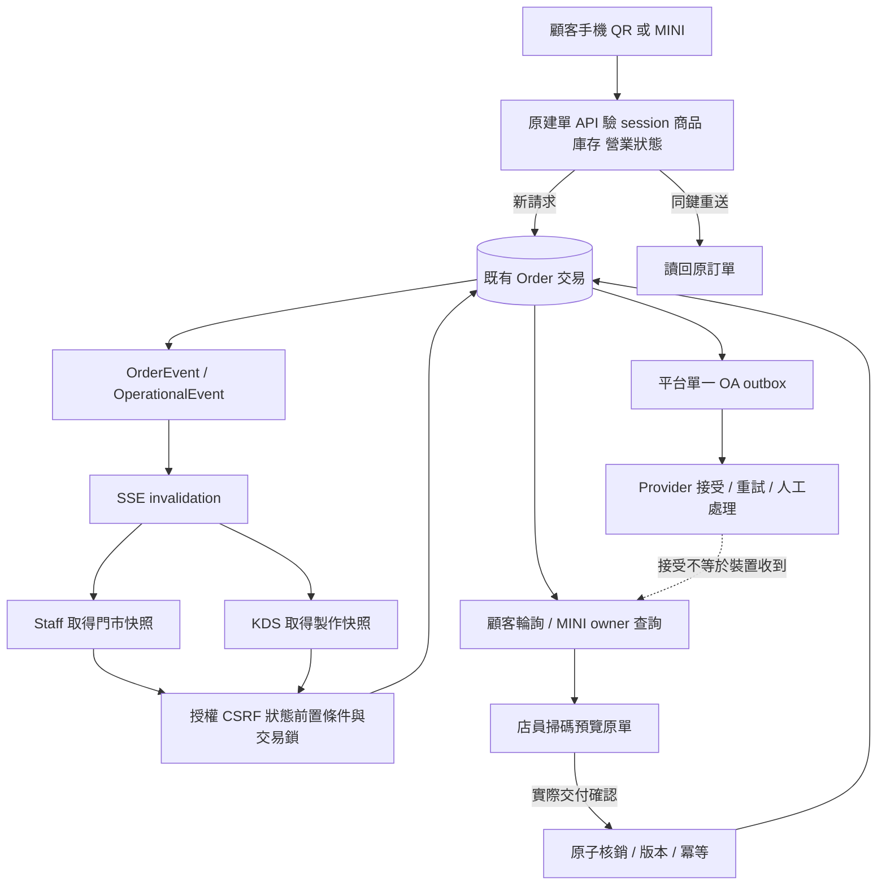

# 跨裝置狀態契約

狀態：SOURCE_OBSERVED＋Design approved（2026-09-30）。來源版本見 current-state；尚未實作或執行本次四端同單驗證。

## 權威與版本

- PostgreSQL原有 `Order`／`OrderItem`／`OrderProductionTask` 為權威（schema:2746／3322／3394）。不另建手機訂單。
- 製作／履約狀態有 WAITING_CONFIRMATION、CONFIRMED、PREPARING、PACKING、READY、COMPLETED及CANCELLED/EXPIRED；各模式不一定全部必經。付款狀態是獨立欄位，不能合併。
- 目前**沒有通用server orderVersion**。已有updatedAt、fulfillmentTimeVersion、menuSnapshotVersion；OrderEvent為UUID＋createdAt。SSE只發invalidation `{}`，不是可重播版本串流。
- Staff本地sequence只能阻擋舊請求結果，不能替代server version。若端到端要求仍需新增後端契約，列獨立決策，不在UI改版中偷偷加migration。
- 改品項已有expectedUpdatedAt、changeId＋requestHash、交易鎖；取餐QR有expectedVersion、idempotencyKey與confirmedHandoff。保持用途分離。

## 同一筆單

## 目前讀取行為

| 消費者 | 現有來源 | 目前機制 | 改版待驗證 |
|---|---|---|---|
| Staff | `staff-order-board-live.ts:38–195`、`use-live-resource.ts` | SSE→Realtime→5秒fallback，30秒安全快照；coalesce、AbortSignal、hidden/offline暫停 | 亂序／重連／撤權後clear；sequence不是server版本 |
| KDS | `kitchen-board.tsx:104–149` | 12秒polling＋SSE，各請求直接setData | 慢舊回應／切店後返回風險；先寫失敗例再接同一lifecycle |
| 一般追蹤 | `public-order-tracker.tsx:651–708` | 3秒polling、AbortSignal、429 Retry-After；部分狀態專項防倒退 | 通用快照順序與取消／改時間競態 |
| MINI | `line-platform-order-refresh.tsx:9–14` | visible時15秒router refresh，切回與手動刷新 | WebView背景返回、登出、owner隔離 |
| Offline Staff | `staff-order-board-refresh.ts:114–121` | 未同步local same-ID覆蓋online（offline-wins） | 不擅改；server已完成而本機pending時需明確處理界線 |

SSE授權在連線建立；50秒壽命、15秒heartbeat。不是逐event驗權。刷新API會重驗，但舊畫面何時遮蔽仍須實測。現有fetch沒有統一硬timeout，不可宣稱已有10秒上限。

## 角色資料與命令

| 角色 | 可讀／授權 | 命令與前置條件 |
|---|---|---|
| 訪客QR | tracking token hash＋device hash | 原公開schema與intake gates；同鍵200、首次201 |
| 平台會員 | 未撤銷identity/member；不可變profile＋environment＋owner order | 既有cart／payment／pickup；店員登入不代替顧客身分 |
| Staff | org/stall有效membership＋VIEW_ORDERS | UPDATE_ORDERS、CSRF、orderId＋stallId、狀態比較／衝突；改單交易鎖 |
| KDS | VIEW_KDS；白名單DTO無電話與付款金額 | UPDATE_PRODUCTION_TASKS；org/stall/task scope；order→item→task固定鎖順序 |
| Merchant／Admin | workspace/report scope／PLATFORM_ADMIN | 舊server權限、step-up與稽核，不因viewport改變 |

授權來源 `authorization.ts:39–181`；未知門市404、匿名401、缺permission403。前端隱藏／展開只是呈現。

## 本輪設計的恢復邊界

UI暫態（filter、selected ID、scroll、editor草稿）與server資料分離；門市／身份變更使舊in-flight結果失效。Pending只代表請求中；未讀回server前不顯示已付款、已列印、已交付。超時先查原結果；不能泛化「重試」為再建單。

所有安全排隊依目前offline能力；收款、外部退款、QR核銷不得新增離線權限。恢復連線時讀權威快照，並在stream ready／reconnect後再次刷新，封閉快照完成與訂閱之間的漏訊窗口（Staff現有onopen已觸發刷新）；重複invalidation合併、舊generation回應丟棄。這些是待驗收要求，不是全部已完成能力。

LINE v2：runtime禁止租戶選sender；每environment唯一PLATFORM_OA。舊店家OA設定不改變此契約。通知SENT目前代表provider接受；Pay adapter在production返回LINE_PAY_SANDBOX_ONLY 503。QR preview與redeem分離，UI尺寸不延長效期。
